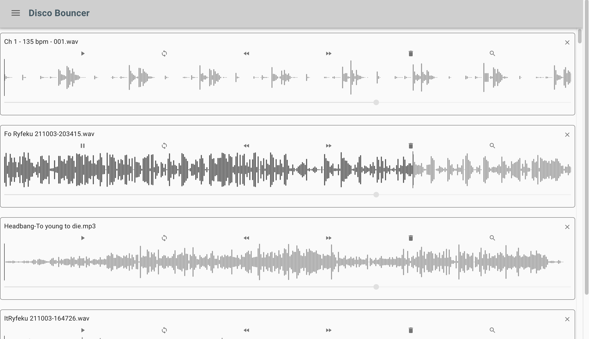

<p align="center">
  
</p>

# Disco Bouncer

## Goal
In order to save time when exploring big amounts of new music data, you want to have a handy helper util.

# Problem
Existing tools lack in providing a real fast workflow. For example you were receiving 3GB of new promos, what to do if you have to play in one hour?

# Approach
Make your music collection great again! Use the Disco Bouncer Util!

# Features
- Blazingly fast!
- Work on a list of files you check if ok or putting out of your collection
- Extract out any music data out of big recursive directory structures
- Quickly tune into every location of the track by just clicking into the waveform
- Using Performance optimizations for just rendering out the needed information (Virtualizing Lists)
- Reveal the music file in the file finder
- If you decide to put out a track, it is just in the trash, so it is reversible data
- Save huge amount of time fiddling arround to get the right track to the right genre
## Operation System Support

It is an electron project. 

## Download and Install

Go to releases and find the latest or beta release. There is a caret with "assets". Please click the caret to have the download links available.

- Mac OSX: Please, download the \*.dmg File (can be seen on "assets" at the bottom here) and double click
- Windows 7 and above: Please, download the \*.exe File (can be seen on "assets" at the bottom here) and double click
- Raspberry-pi 4 and above: Please, download the AppImage File, chmod +x the file to make it executable and then start it


<p align="center">
  
</p>

# For Developers

Below you will find a step by step guide to set up local develpment environment. Feel free to contribute to this project.

## Installation

At first copy the .env.sample to .env, if you have none.

```
yarn install
```

# Webapp

The webapp will not work properly with dragging and dropping files. This is only supported int eh elctron app.

## Start Development

```
yarn start
```

## Build for Production

```
yarn build
```

# Electron App

The app can be installed from packages for MacOSX, Rasperry Pi and Win. If you like to develop or build for yourself, please follow the instructions.

## Start Development

```
yarn dev
```

## Build for MacOSX, Rasperry Pi and Win

```
yarn build-ci
```

# Versioning

https://github.com/conventional-changelog/standard-version
